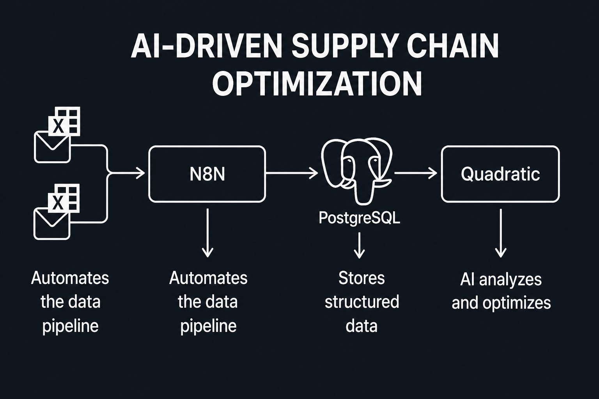

<div align="center">

# 🚚 AI-Driven Supply Chain Optimization
### Intelligent Supply Chain Analytics using n8n, Gmail, Supabase PostgreSQL & Quadratic


### AI • Automation • ETL • Business Intelligence • Portfolio Project

</div>

---

# ✨ Project Overview

This project demonstrates an automated end-to-end Supply Chain Analytics pipeline that continuously processes operational data and transforms it into actionable business insights.

Using **n8n** for workflow automation, **Gmail** as the incoming data source, **Supabase PostgreSQL** as the cloud database, and **Quadratic** for analysis, the system eliminates manual data ingestion while enabling real-time supply chain performance monitoring.

The solution tracks key logistics metrics including **OTIF**, **LFR**, and **VFR**, helping businesses identify operational bottlenecks and improve decision-making.

---

# 🎯 Business Objectives

- Automate supply chain data ingestion
- Eliminate manual CSV processing
- Build a centralized cloud database
- Monitor OTIF, LFR and VFR KPIs
- Enable real-time business reporting
- Improve operational visibility

---

# 🚀 Key Features

✅ Automated Email-Based ETL Pipeline

✅ Gmail Trigger for Incoming Order Files

✅ Data Cleaning & Transformation

✅ Automated PostgreSQL Data Loading

✅ Supply Chain KPI Calculation

✅ Interactive Quadratic Analytics

✅ Cloud-Based Architecture

---
# 🔄 Workflow
<p align="center">
  
</p>

---

# ⚙️ System Architecture

```
Incoming CSV Files
        │
        ▼
 Gmail Trigger (n8n)
        │
        ▼
Data Extraction
        │
        ▼
Cleaning & Transformation
        │
        ▼
Supabase PostgreSQL
        │
        ▼
Quadratic Dashboard
        │
        ▼
Business Insights
```

---

# 📊 Supply Chain KPIs

| KPI | Description |
|------|-------------|
| OTIF | On-Time In-Full Delivery |
| LFR | Line Fill Rate |
| VFR | Volume Fill Rate |
| Revenue | Total Order Revenue |
| Order Volume | Daily Orders |
| Customer Performance | Supplier-wise Metrics |

---

# 🛠 Technology Stack

| Technology | Purpose |
|------------|----------|
| n8n | Workflow Automation |
| Gmail | Data Trigger |
| Python | Data Cleaning & Processing |
| PostgreSQL (Supabase) | Cloud Database |
| SQL | Data Querying |
| Quadratic | Analytics & Visualization |
| CSV Files | Data Source |

---

# 📂 Dataset

The project uses:

- Customer Master
- Product Master
- Target Orders
- Order Line Data
- Aggregate Sales Data

Incoming transactional files are automatically processed whenever new emails arrive.

---

# 📈 Business Insights Generated

- OTIF Performance
- Supplier Performance
- Customer Service Level
- Order Fulfillment Trends
- Revenue Analysis
- Delivery Performance
- Product-wise Analysis

---

# 📁 Project Structure

```
AI-Driven-Supply-Chain-Optimization

│── Dataset
│── Workflow
│── SQL Scripts
│── Images
│── README.md
```

---

# 💡 Future Enhancements

- Live ERP Integration
- Demand Forecasting
- Inventory Optimization
- Supplier Risk Analysis
- Power BI Dashboard
- Predictive Analytics

---

# 👨‍💻 Skills Demonstrated

- ETL Pipeline Design
- Workflow Automation
- SQL
- PostgreSQL
- Data Engineering
- Supply Chain Analytics
- KPI Development
- Business Intelligence
- Process Automation

---

# 📬 Contact

**Ch Sanjana**

📧 sanjanach78@gmail.com

💼 LinkedIn: *(linkedin.com/in/ch-sanjana)*

⭐ If you found this project useful, feel free to star the repository!
